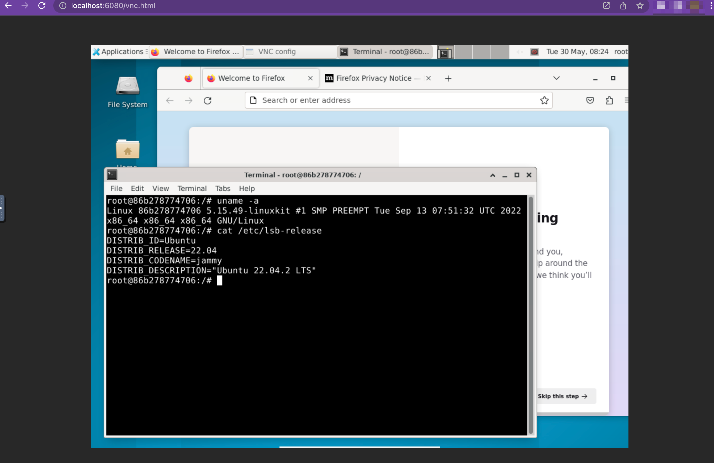

# docker-ubuntu-desktop
Ubuntu Desktop Web Browser Accessible Docker Image

## ScreenShot


## Usage
```
$ docker run -it --platform=linux/amd64 -p 6080:6080 akarita/docker-ubuntu-desktop
```

## Access
```
http://localhost:6080/vnc.html
```

or

```
https://localhost:6080/vnc.html
```

## DockerHub

https://hub.docker.com/r/akarita/docker-ubuntu-desktop

## Docker Pull
```
$ docker pull akarita/docker-ubuntu-desktop
```

## Docker Build
```
$ docker build . -t docker-ubuntu-desktop
```

## License
MIT License (c) 2023 [Takahashi Akari](https://github.com/takahashi-akari)
